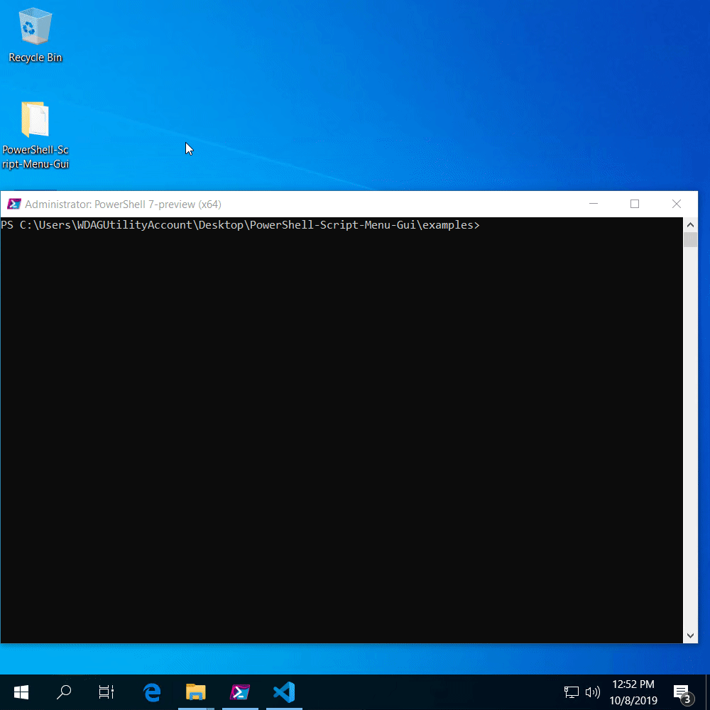

# PSScriptMenuGui

  

Do you have favourite scripts that go forgotten?

Does your organisation have scripts that would be useful to frontline staff who are not comfortable with the command line?

This module uses a CSV file to make a graphical menu of PowerShell scripts.

It's easy to customise and fast to launch.

You can also add Windows programs and files to the menu.

Just a few minutes to setup and - *click! click!* - you're away!

## Try it out

### Tutorial

Looking for a step-by-step introduction? [**See this blog post.**](https://blog.osull.com/2019/11/06/tutorial-use-a-csv-file-to-make-a-graphical-menu-of-powershell-scripts/)

### Install from the PowerShell Gallery

    Install-Module PSScriptMenuGui -Scope CurrentUser
    New-ScriptMenuGuiExample
    cd PSScriptMenuGui_example
    .\PSScriptMenuGui.ps1

### Clone from GitHub

    git clone https://github.com/weebsnore/PowerShell-Script-Menu-Gui
    cd PowerShell-Script-Menu-Gui\PSScriptMenuGui\examples
    .\PSScriptMenuGui.ps1

## Problems and feedback

How are you finding the module? Is it useful? *(Please share a screenshot!)*

Are you stuck? Do you want a feature?

Please [open a GitHub issue](https://github.com/weebsnore/PowerShell-Script-Menu-Gui/issues) or get in touch.

[@dan_osull.com](https://twitter.com/dan_osull_com/) *- follow me for updates!*  
https://blog.osull.com  
powershell@osull.com

## Compatibility

Tested with **PowerShell 5.1 x64** and **PowerShell 7 x64** on Windows 10.

## Basic usage

    Show-ScriptMenuGui -csvPath '.\example_data.csv' -Verbose

## Show-ScriptMenuGui options

Parameter | What is it?
:--- |:---
`-csvPath` | Path to CSV file that defines the menu. See [CSV reference](#csv-reference), below.
`-windowTitle` *(optional)* | Custom title for the menu window
`-buttonForegroundColor` *(optional)* | Custom button foreground (text) color. Hex codes (e.g. `#C00077`) and color names (e.g. `Azure`) are valid. See [.NET Color Class](https://docs.microsoft.com/en-us/dotnet/api/system.windows.media.colors).
`-buttonBackgroundColor` *(optional)* | Custom button background color
`-iconPath` *(optional)* | Path to .ico file for use in menu
`-hideConsole` *(optional)* | Hide the PowerShell console that the menu is called from. **Note:** This means you won't be able to see any errors from button clicks. If things aren't working, this should be the first thing you stop using.
`-noExit` *(optional)* | Start all PowerShell instances with `-NoExit` *("Does not exit after running startup commands.")*. **Note:** You can set `-NoExit` on individual menu items by using the *Arguments* column. See [CSV reference](#csv-reference), below.

See [`PSScriptMenuGui_all_options.ps1`](PSScriptMenuGui/examples/PSScriptMenuGui_all_options.ps1) for an example using every option.

## CSV reference

This table details how to lay out the CSV file for your menu.

The top row of your CSV should contain the column headers. Each row after this defines a menu item.

Column header | What is it?
:--- |:---
Section *(optional)* | Text for heading
Method | What happens when you click the button? Valid options: `cmd` \| `powershell_file` \| `powershell_inline` \| `pwsh_file` \| `pwsh_inline`
Command | Path to target script/executable (`cmd` or `_file` methods) ***or*** PowerShell commands (`_inline` methods)
Arguments *(optional)* | Arguments to pass to target executable (`cmd` method) ***or*** to the PowerShell exe (other methods)
Name | Text for button
Description *(optional)* | Text for description 

### Some examples

Section | Method | Command | Arguments | Name | Description
:---|:---|:---|:---|:---|:---
Old school | `cmd` | `taskmgr.exe` | | Example 2: cmd | External executable
Old school | `cmd` | `notepad.exe` | `example_text_file` | Example 3: cmd | External executable with arguments
Less old | `powershell_file` | `example_target.ps1` | | Example 4: powershell_file | .ps1 file called with powershell.exe
Less old | `powershell_inline` | `$PSVersionTable` | `-NoExit -WindowStyle Maximized` | Example 6: powershell_inline | Additional powershell.exe arguments
The future | `pwsh_file` | `example_target.ps1` | | Example 7: pwsh_file | .ps1 file called with pwsh.exe
The future | `pwsh_inline` | `& .\example_target.ps1 -Message "passed in via param"` | |Example 9: pwsh_inline | .ps1 file called with parameter

See [`example_data.csv`](PSScriptMenuGui/examples/example_data.csv) for further examples in CSV format.

### Tips

- Relative paths, network paths and paths in your environment should work.
- `<LineBreak />` is supported in text fields.
- You can add multiple `_inline` commands by separating with a semi-colon (`;`)
- Excel makes a good editor!
- But watch out for Excel turning e.g. `-NoExit` into a formula. Best workaround is to prefix with a space.

